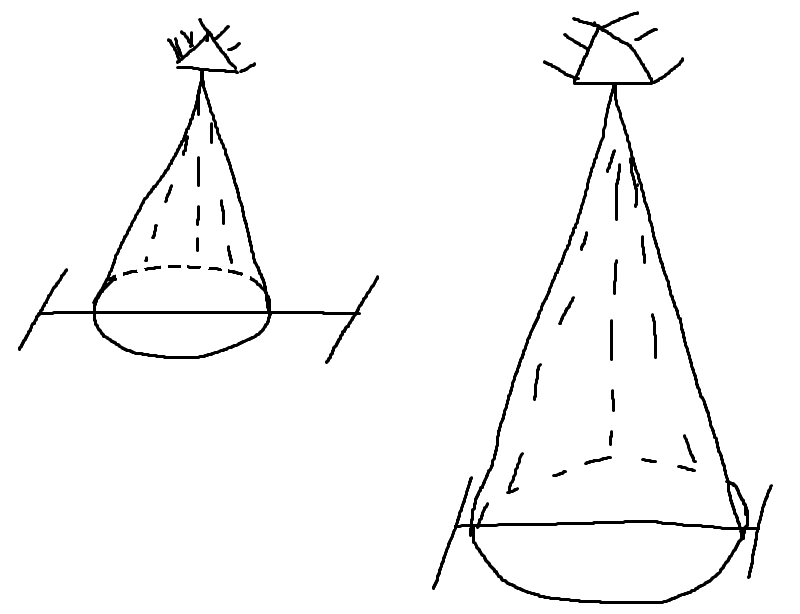
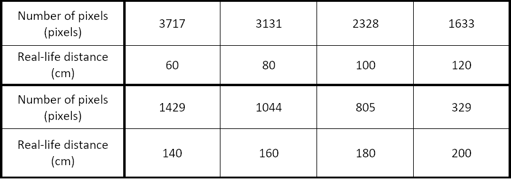
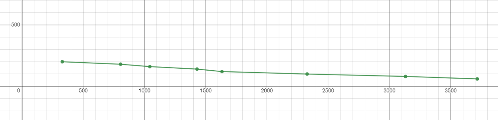
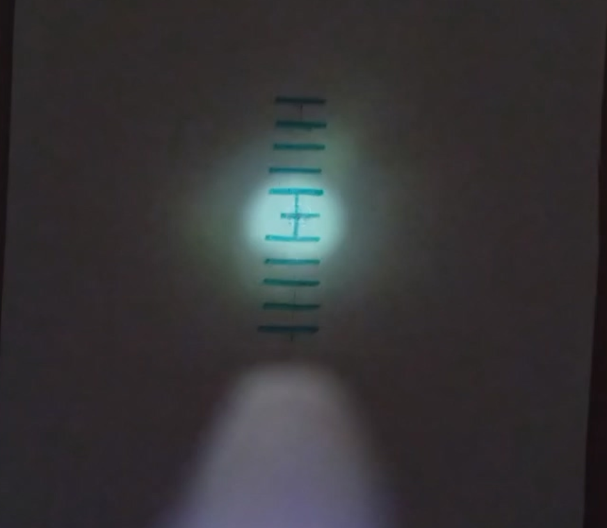
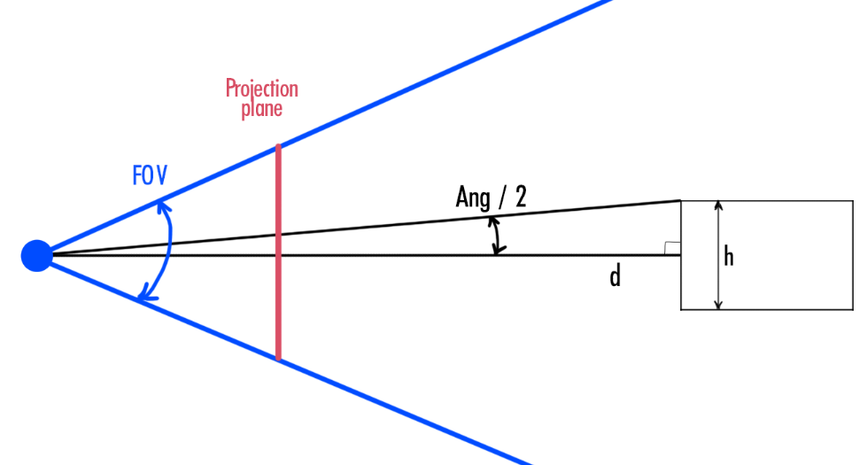
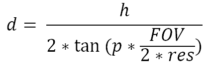
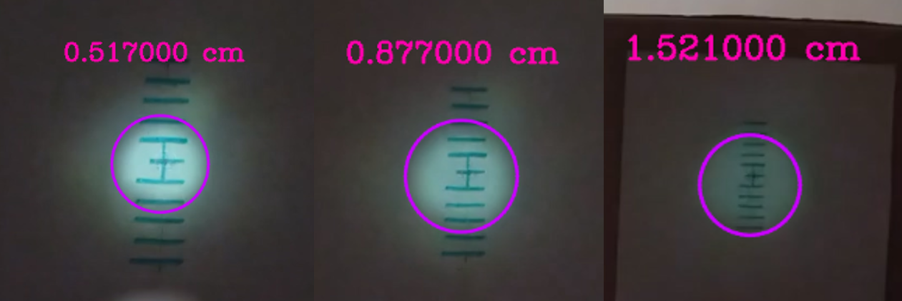

# Light Cone

This projects aims to perform a distance calculation based on the light circle on an object's surface.

## Idea

The main idea for handling the project's problem was to convert the pixels of detected by applying a mask to the image light circle to centimeters.

## Setup

The setup of the project is really simple - a smartphone's flashlight covered by a paper tube in order to minimize dispersion of the light and a box.

<center></center>

## Approaches

To know real-world distance from only light circle on a surface is impossible without knowing any real-world data for pixel mapping.

This problem was solved with two approaches:

1. Make several measurements, create a correlation and use the derived formula.

The table below shows the obtained results from 8 measurements.

<center></center>

By taking number of pixels as Y and real-life distance as X, an approximate function of the correlation can be found. This function happened to be very similar to a linear function, which was a surprise, because linearity is the simplest correlation to work with.

<center></center>

Thus, the approximate function would look like:

```
f(x) = -0.041 * x + 213.595
```

2. The other solution of performing measurements from a light cone is based on how many pixels are correlated to a height of the object. This method requires a reference object which height is known, camera’s FOV, resolution of the video and the number of pixels themselves. The object in this project being a circle of light, thus the easiest way to measure it would be painting scales on the moving object.

<center></center>

Each tick of the marker represents 1 cm, so knowing the actual size of the circle would no longer stand a problem. And before moving into finding the height of this circle (its diameter, essentially), it is crucial to understand how this correlation between real-life height and height in pixels using FOV and angles helps with the calculations.

<center></center>

This way, knowing of the real height of the object, its height in pixels, FOV of camera and resolution of the video, distance to the object can be calculated by:

<center></center>

Where *d* – distance to the object, *h* – the height of the object, *p* – the object’s height in pixels, *FOV* – FOV of the phone’s camera in degrees, and *res* – vertical resolution of the video.

Diameter of the circle can be found using Hough's circles detection.

Within a certain tolerance, the algorithm performed rather well, with real distance being 0.5 and 1.5 meters. The middle value was unknown, but, by rough estimation, the obtained value was close to real.

<center></center>

## Usage

Requires Visual Studio and .NET Framework >=4.8. Works only on Windows, sadly.

Download the VS solution with the project, it in the Visual Studio, uncomment one of the lines in `main.cpp` to test how one of the modules work.

```
// linear(cap, image, FILENAME);
// mask(image);
// circles();
// palette(cap, image);
```

- `linear` performs calculation from the video in `Resources`.
- `mask` performs masking of the light circle.
- `circles` performs Hough's detection and applying the formula shown in point 2.
- `palette` is just a simple approximation program to compute a 5 color palette of the image.

## Ideas of improvement

1. Use a real laser instead of the flashlight, preferably red, as red is more robust when it comes to masking rather than white
2. Fell free to contribute (: